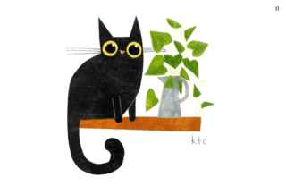

# Catastrophe
### Implementation of a [Useless Box](https://www.youtube.com/watch?v=aqAUmgE3WyM) within a game using Unity engine and C#.
 [\[_Click here to play in browser!_\]](https://shilpi33x.github.io/Catastrophe/)\
 \
 
 
### Features:
 * Randomized response time before flipping the switch - or in this case, knocking the vase over
 * Rabdomized variable animation speeds
 * Blink/fidget animations play after short random intervals
 * Chance to have a "special" animation play after every X clicks
### Additional Credits:
 * Artwork by Karen Obuhanych, [@kto_art](https://www.instagram.com/kto_art/) on Instagram.
 * Music from [Bensound.com](https://www.bensound.com/)
